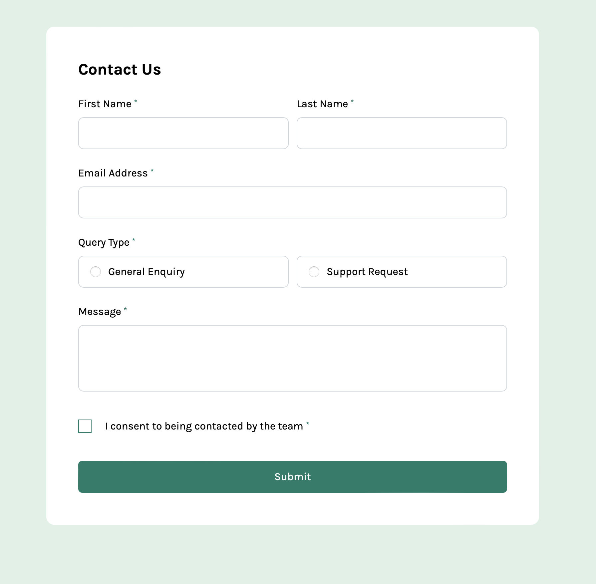

# Frontend Mentor - Contact form solution

This is a solution to the [Contact form challenge on Frontend Mentor](https://www.frontendmentor.io/challenges/contact-form--G-hYlqKJj). Frontend Mentor challenges help you improve your coding skills by building realistic projects.

## Table of contents

- [Overview](#overview)
  - [The challenge](#the-challenge)
  - [Screenshot](#screenshot)
  - [Links](#links)
- [My process](#my-process)
  - [Built with](#built-with)
  - [What I learned](#what-i-learned)
  - [Continued development](#continued-development)
  - [Useful resources](#useful-resources)
- [Author](#author)

## Overview

### The challenge

Users should be able to:

- Complete the form and see a success toast message upon successful submission
- Receive form validation messages if:
  - A required field has been missed
  - The email address is not formatted correctly
- Complete the form only using their keyboard
- Have inputs, error messages, and the success message announced on their screen reader
- View the optimal layout for the interface depending on their device's screen size
- See hover and focus states for all interactive elements on the page

### Screenshot



### Links

- Solution URL: https://github.com/Jake-Oz/contact-form
- Live Site URL: https://contact-form-pied-delta.vercel.app

## My process

### Built with

- [React](https://reactjs.org/) - JS library
- [Next.js](https://nextjs.org/) - React framework
- [Tailwind CSS](https://tailwindcss.com/) - For styles
- [React-Hook-Form](https://www.react-hook-form.com) - For performant Form with validation
- [Zod](https://zod.dev) - For Client and Server side Typescript-first validation
- [React-Hot-Toast](https://react-hot-toast.com) - For Toast functionality

### What I learned

For this project I learned a lot more about form validation options and best practice. While validation is largely done on the client, I learnt how to use Zod to enable validation on the server as well. This will be handy for more complex applications or when using an API.

Key to incorporating Zod into React-Hook-Form is to import the Zod resolver and then incorporate into the React-Hook-Form 'useForm' function. See code below:

```tsx
const {
  register,
  handleSubmit,
  formState: { errors, isSubmitting },
  reset,
} = useForm<TContactSchema>({
  resolver: zodResolver(contactSchema),
  defaultValues: { terms: false },
});
```

### Continued development

I would like to continue to develop my understanding of form validation and how to incorporate it into more complex applications. I would also like to learn more about how to use Zod for server side validation.

### Useful resources

- [ByteGrad YouTube Chanel](https://www.youtube.com/watch?v=u6PQ5xZAv7Q) - This was a great tutorial on how to use Zod with React-Hook-Form. It was clear and easy to follow.
- [React-Hook-Form](https://www.react-hook-form.com) - This is a great resource for learning how to use React-Hook-Form. It is well documented and easy to follow.

## Author

- Frontend Mentor - [@Jake-Oz](https://www.frontendmentor.io/profile/Jake-Oz)
